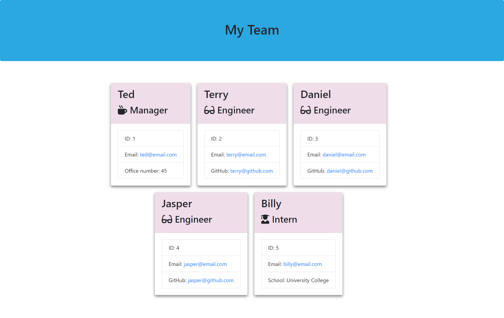

# employee-team-profile-generator

## Description
This is an software engineering employee team profile command-line application that accepts user input so that when a user is prompted for information about the team then an employee team profile is generated with the information provided.

The user can input any number of team members to go with the team manager and this may be a mix of engineers and interns. When the user has completed building the team, the user exits the application and an HTML file is generated which displays a team rota based on the user input.

The application uses the command: node index.js to start and then the user is prompted for input starting with the team manager details and then that of other team members after which,these details are used to generate the employee team profile.

## Screenshot

The following image shows ascreenshot of the generated HTML’s appearance and functionality:

